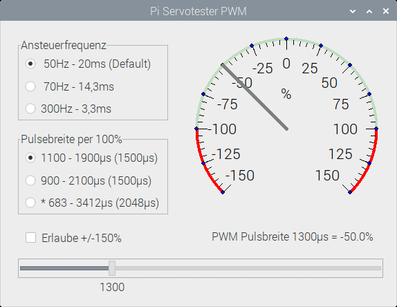

# PiServoTester
Simple PWM servo tester

Der Pi Servotester PWM ist ein schlankes Programm für den Raspberry Pi mit grafischer Oberfläche zum Testen von Modellbau-Servos.
Es benutzt einen der beiden Hardware-PWM-Kanäle, welche mit sysfs angesteuert werden. Wir brauchen also keine weiteren Programme, kein Python, kein WiringPi oder PiGPIO, nix.

Wichtiger Hinweis: Zuerst das Programm starten und dann erst den Servo anschließen!

Das Programm benötigt zum Kompilieren das Package "Industrial". Man kann es einfach über den OnlinePackageManager nachinstallieren.

HW-PWM Anschluss freischalten:
	sudo nano bootconfig.txt
Hier folgende Zeilen eintragen:
	[PWM0 auf GPIO18 freigeben]
	dtoverlay=pwm,pin=18,func=2
Speichern und reboot. Prüfen, ob es jetzt ein Verzeichnis /sys/class/pwm/pwmchip0 gibt. Wenn ja, alles OK.
